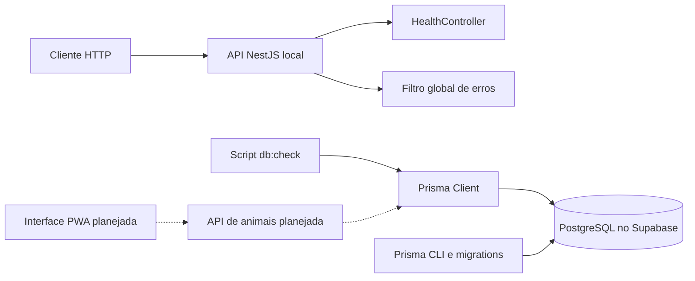
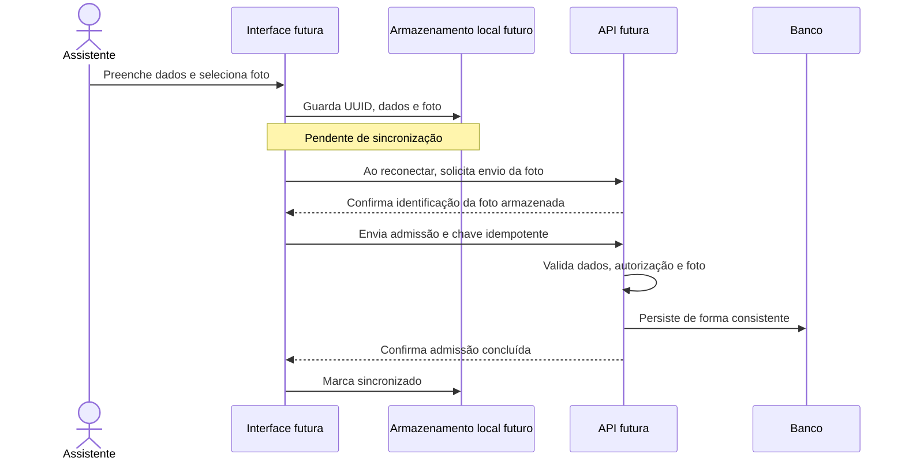
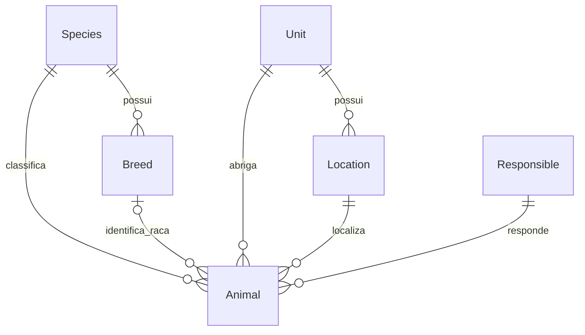
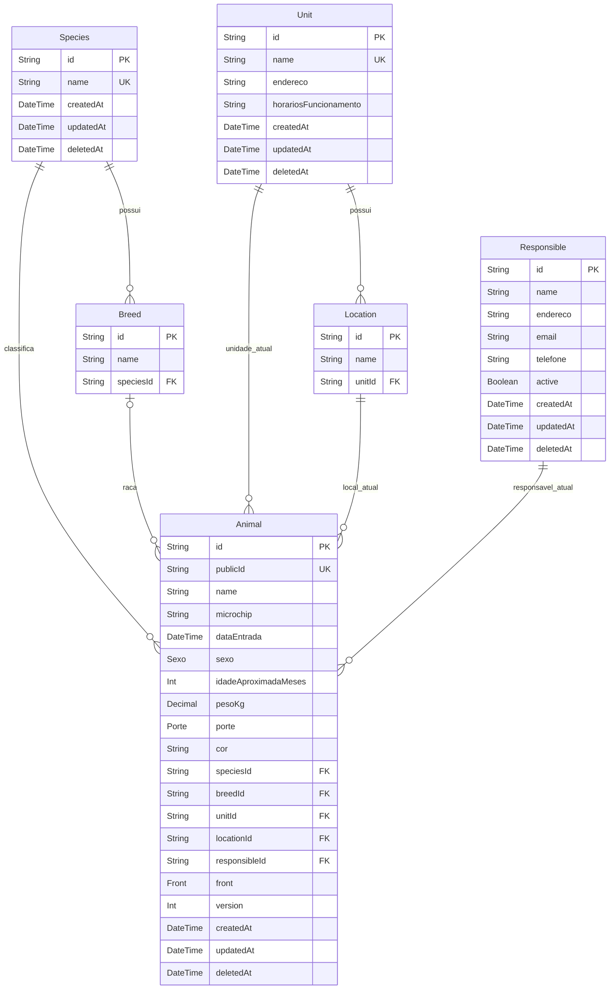

# WAD — Web Application Document

> Este documento registra o estado real da fundação do backend na Sprint 1. Contrato OpenAPI, teste HTTP, exemplo de ambiente e CI com variáveis fictícias estão implementados e validados localmente. A execução remota do CI, a revisão do painel Supabase e a homologação ainda dependem de evidência externa.

## Instituto Ampara Animal — Inteli Social

**Projeto:** aplicação web de prontuário e identificação animal  
**Parceiro:** Instituto Ampara Animal  
**Iniciativa:** Inteli Social  
**Estágio documentado:** fundação do backend, Sprint 1 do Ciclo 1  
**Data da revisão:** 13 de setembro de 2026  
**Equipe e orientação:** identificação dos integrantes e do orientador a completar pela equipe.

O conteúdo descreve o projeto Ampara Animal, com base no TAPI, nas anotações de reunião e nos arquivos do repositório. Não transfere integrantes, imagens, resultados de testes ou funcionalidades do projeto de referência.

**Legenda:** implementado = existe no código; preparado = artefato disponível, ainda sem operação completa; planejado = requisito ou proposta sem implementação; pendente = depende de decisão ou evidência. O documento não representa homologação da solução pela Ampara.

## Descrição curta

A solução pretende centralizar a identificação e o acompanhamento dos animais atendidos pela Ampara, substituindo a dispersão de dados em papel, planilhas e formulários por registros organizados. O Ciclo 1 contempla admissão com foto e localização, seguida de consulta por nome, identificador público ou espécie. O uso operacional será pelo assistente, prioritariamente no computador, com necessidade de continuidade em locais sem internet.

Atualmente existe uma aplicação NestJS, um modelo Prisma e duas migrations cuja aplicação no Supabase de desenvolvimento foi confirmada nas verificações anteriores desta sessão. Ainda não existe o fluxo funcional de cadastro de animais, interface PWA ou sincronização offline. Esta revisão documental não consultou novamente o banco remoto.

## Estrutura do repositório

```text
Inteli-social/
├── .github/workflows/ci.yml
├── contracts/openapi.json
├── docs/
│   └── wad.md
├── test/
│   ├── ambiente.cjs
│   └── saude-http.spec.ts
├── scripts/validar-openapi.cjs
├── prisma/
│   ├── schema.prisma
│   └── migrations/
│       ├── 20260913170000_init/
│       ├── 20260913230422_adicionar_dados_admissao/
│       └── migration_lock.toml
├── src/
│   ├── main.ts
│   ├── app.module.ts
│   ├── common/filtros/filtro-excecao-global.ts
│   ├── database/check-connection.ts
│   └── health/
│       ├── health.module.ts
│       ├── health.controller.ts
│       └── health.controller.spec.ts
├── package.json
├── package-lock.json
├── tsconfig.json
├── tsconfig.build.json
├── nest-cli.json
├── jest.config.cjs
├── eslint.config.mjs
├── prettier.config.mjs
├── docker-compose.yml
└── .env.example
```

O arquivo local de segredos não integra a documentação. O arquivo .env.example contém placeholders. O OpenAPI em contracts/ é um artefato técnico validado localmente. As ações externas da Sprint 1 estão em [acoes-manuais-sprint-1.md](acoes-manuais-sprint-1.md).

## Sumário

1. [Introdução](#1-introdução)
2. [Visão geral da aplicação](#2-visão-geral-da-aplicação)
3. [Projeto da aplicação](#3-projeto-da-aplicação)
4. [Desenvolvimento e implantação](#4-desenvolvimento-e-implantação)
5. [Testes e evidências](#5-testes-e-evidências)
6. [Adoção e sustentabilidade](#6-adoção-e-sustentabilidade)
7. [Conclusões e trabalhos futuros](#7-conclusões-e-trabalhos-futuros)
8. [Referências e fontes](#8-referências-e-fontes)

# 1. Introdução

O TAPI descreve a dificuldade de acompanhar animais quando suas informações estão distribuídas entre registros físicos, planilhas e ferramentas não integradas. A ausência de uma ficha central dificulta recuperar identificação, origem e informações de atendimento e prejudica a continuidade do trabalho entre pessoas e locais.

A proposta é construir uma aplicação web que acompanhe a entrada, a estadia e a saída do animal, por ciclos. A fundação atual se concentra na identificação e na organização dos dados. Histórico clínico, relatórios, alertas e destinação final serão desenvolvidos nas etapas previstas, conforme validação do parceiro.

As anotações recentes atualizam a persona operacional para **assistente** e priorizam o computador. O funcionamento offline continua necessário em mutirões e outros locais com conectividade limitada. A estimativa de simultaneidade não está fechada: as anotações citam até 12 pessoas e, em outro trecho, menos de 50.

# 2. Visão geral da aplicação

## 2.1. Escopo e proposta de valor

| Ciclo                      | Objetivo                        | Entregas previstas                                         |
| -------------------------- | ------------------------------- | ---------------------------------------------------------- |
| 1 — O Alicerce             | Cadastrar e encontrar um animal | Modelo, API, admissão com foto, busca, primeira publicação |
| 2 — Prontuário clínico     | Acompanhar saúde                | Eventos clínicos, histórico, PDF e anexos                  |
| 3 — Inteligência e alertas | Apoiar acompanhamento e gestão  | Alertas, painéis e notificações                            |
| 4 — Saída e pós-adoção     | Registrar destinação            | Saída, documentos e acompanhamento posterior               |

Na Sprint 1, o foco é preparar modelo, repositório, contrato, qualidade, CI/CD e ambientes. Admissão, alterações/arquivamento, validações e foto pertencem à Sprint 2; busca/listagem e publicação do MVP, à Sprint 3; interface e estrutura PWA, ao frontend. A existência das tabelas não significa que a admissão esteja disponível aos assistentes.

### 2.1.1. Cinco forças — adaptação ao projeto social

Esta é uma análise qualitativa proposta pela documentação, sem pesquisa de mercado ou validação institucional. A ferramenta de Porter é adaptada para discutir sustentabilidade, não para atribuir competição comercial à Ampara.

| Dimensão                | Leitura para o projeto                                                               |
| ----------------------- | ------------------------------------------------------------------------------------ |
| Alternativas existentes | Papel, planilhas e formulários são as alternativas citadas nas fontes                |
| Novas soluções          | Outras ferramentas de cadastro podem ser avaliadas por adequação operacional         |
| Substitutos             | Manter o processo atual evita mudança imediata, mas preserva a fragmentação descrita |
| Fornecedores            | Banco, hospedagem e armazenamento exigem manutenção e planejamento de continuidade   |
| Usuários e instituição  | A aderência ao atendimento e a clareza da ficha determinarão a adoção                |

### 2.1.2. SWOT — análise proposta

| Forças                                                                                        | Fraquezas                                                                                                |
| --------------------------------------------------------------------------------------------- | -------------------------------------------------------------------------------------------------------- |
| Parceiro fornece conhecimento do atendimento; projeto reúne equipe técnica e demanda concreta | Requisitos ainda em validação; aplicação limitada à fundação; ausência de interface e controle de acesso |

| Oportunidades                                                       | Ameaças                                                                                                               |
| ------------------------------------------------------------------- | --------------------------------------------------------------------------------------------------------------------- |
| Padronizar registros, reduzir retrabalho e melhorar rastreabilidade | Falhas de conectividade, exposição indevida de informações, ampliação prematura do escopo e dependência de manutenção |

### 2.1.3. Value Proposition Canvas

- **Tarefas dos assistentes:** registrar chegada, identificar animal e responsável, consultar ficha e atualizar dados autorizados.
- **Dores relatadas:** fragmentação dos registros e dificuldade de recuperar informações; conectividade limitada em certas operações.
- **Ganhos esperados:** identificação confiável, fotografia associada à ficha e continuidade entre equipes.
- **Produto proposto:** cadastro e consulta centralizados, com fluxo offline e expansão por ciclos.
- **Validação necessária:** observar um atendimento real e verificar se a ordem dos campos e a captura da foto correspondem à operação.

### 2.1.4. Matriz de riscos

As prioridades abaixo são avaliação técnica preliminar, não resultado de medição.

| Risco                               | Prioridade | Tratamento proposto                                                                      |
| ----------------------------------- | ---------- | ---------------------------------------------------------------------------------------- |
| Requisitos contraditórios           | Alta       | Registrar decisões e validar obrigatoriedade e classificação de locais                   |
| Dados acessíveis sem autorização    | Alta       | Revisar caminhos de acesso e implementar autenticação/autorização antes do uso real      |
| Perda ou duplicação offline         | Alta       | Fila local durável, idempotência e política explícita de conflitos                       |
| Ficha concluída sem foto            | Alta       | Confirmar upload antes da conclusão no servidor                                          |
| Migração incompatível com dados     | Alta       | Revisão de SQL, ambiente separado e verificação de compatibilidade                       |
| CI dependente de configuração local | Média      | Variáveis fictícias de validação no executor e nenhuma conexão remota nos testes básicos |
| API sem hospedagem definida         | Média      | Selecionar provedor e documentar publicação e recuperação                                |

## 2.2. Personas

São perfis derivados das fontes, sem nomes, fotografias ou entrevistas fictícias.

| Perfil             | Objetivo                                                        | Necessidades                                                           |
| ------------------ | --------------------------------------------------------------- | ---------------------------------------------------------------------- |
| Assistente         | Cadastrar e consultar animais; atualizar informações permitidas | Computador, ficha clara, foto de qualidade e continuidade sem internet |
| Médico veterinário | Registrar e acompanhar informações clínicas                     | Histórico e autoria dos registros, previstos principalmente no Ciclo 2 |
| Gestor             | Acompanhar operação e resultados                                | Consulta consolidada e painéis futuros                                 |

A autorização de assistentes para atualizar saúde foi mencionada na reunião. Os campos editáveis e os limites por perfil continuam pendentes. Responsável pelo animal, profissional clínico e usuário autenticado não devem ser tratados automaticamente como a mesma pessoa.

## 2.3. Histórias de usuário

| ID   | História                                                    | Critério de aceitação proposto                                             | Situação                           |
| ---- | ----------------------------------------------------------- | -------------------------------------------------------------------------- | ---------------------------------- |
| US01 | Como assistente, quero registrar a chegada de um animal     | Registro associado à espécie, origem operacional e foto antes da conclusão | Planejado                          |
| US02 | Como assistente, quero informar microchip quando disponível | Valor textual preserva zeros e não substitui a identificação interna       | Campo implementado; fluxo pendente |
| US03 | Como assistente, quero localizar uma ficha                  | Busca por nome, identificador público ou espécie                           | Planejado                          |
| US04 | Como assistente, quero registrar sem internet               | Dados e foto preservados localmente e sincronização visível                | Planejado                          |
| US05 | Como usuário autorizado, quero corrigir informações         | Atualização respeita permissões e detecta versão desatualizada             | Planejado                          |
| US06 | Como gestor, quero arquivar uma ficha                       | Arquivamento preserva registro conforme política aprovada                  | Proposta apoiada por deletedAt     |
| US07 | Como profissional clínico, quero acompanhar evolução        | Eventos mantêm datas e autoria                                             | Ciclo 2                            |

# 3. Projeto da aplicação

## 3.1. Requisitos, regras e rastreabilidade

| ID   | Requisito/regra                                | Estado real                                                | Evidência ou pendência                                                     |
| ---- | ---------------------------------------------- | ---------------------------------------------------------- | -------------------------------------------------------------------------- |
| RF01 | Cadastro animal                                | Somente modelo                                             | Animal em schema.prisma; nenhum controller de cadastro                     |
| RF02 | Foto obrigatória na entrada                    | Confirmado no requisito                                    | Sem coluna/relação de foto ou upload implementado                          |
| RF03 | Consulta com filtros                           | Planejado                                                  | Documento de contrato; índices já existentes                               |
| RF04 | Microchip                                      | Coluna opcional implementada                               | String, sem unicidade e sem obrigação de preenchimento                     |
| RF05 | Atualização e arquivamento                     | Estrutura parcial                                          | version e deletedAt; sem operações HTTP                                    |
| RF06 | Catálogos operacionais                         | Tabelas/enum presentes                                     | Endpoints e gestão ainda ausentes                                          |
| RF07 | Offline                                        | Planejado                                                  | Não existe armazenamento local, fila ou sincronização                      |
| RF08 | Disponibilidade da API                         | Implementado                                               | GET /api/health                                                            |
| RN01 | Raça deve corresponder à espécie               | Implementado na migration pendente de aplicação autorizada | FK composta `Animal(breedId, speciesId)` referencia `Breed(id, speciesId)` |
| RN02 | Localização deve pertencer à unidade do animal | Implementado na migration pendente de aplicação autorizada | FK composta `Animal(locationId, unitId)` referencia `Location(id, unitId)` |
| RN03 | Repetições não podem duplicar cadastro         | Proposta                                                   | Chave primária única não implementa todo o protocolo idempotente           |
| RN04 | Conflitos devem ser detectados                 | Proposta                                                   | Campo version sem incremento/checagem de negócio implementados             |
| RN05 | Ficha concluída exige foto                     | Confirmado no requisito                                    | Fluxo e persistência ainda necessários                                     |

### 3.1.1. Obrigatoriedade e incertezas

O banco exige identificador, identificador público, espécie, unidade, localização, responsável e frente no Animal. Nome e raça são opcionais. Os novos campos de admissão também são opcionais no schema atual.

Isso descreve a implementação, não a aprovação integral da ficha pela Ampara. As anotações indicam registro completo com peso, espécie, foto, data, sexo, idade, porte e cor. É necessário conciliar essa expectativa com situações de informação desconhecida e com a avaliação clínica inicial. Não se deve preencher valores fictícios para satisfazer restrições.

Mutirão, Mantenedor, Encontrei um amigo e atendimento de silvestres ainda precisam ser classificados. O enum Front permanece CCPA, CASADOTE e CED. Endereço e horário de unidade são textos opcionais, sem estrutura de agenda.

### 3.1.2. Requisitos não funcionais

| Dimensão         | Diretriz                                        | Evidência atual                                                 |
| ---------------- | ----------------------------------------------- | --------------------------------------------------------------- |
| Usabilidade      | Priorizar computador e mensagens compreensíveis | Sem interface validada                                          |
| Confiabilidade   | Preservar cadastro e foto em interrupções       | Offline ainda ausente                                           |
| Segurança        | Autenticar e limitar acesso aos registros       | Sem autenticação/autorização                                    |
| Desempenho       | Suportar operação concorrente                   | Meta de 12 versus menos de 50 pendente; sem teste de carga      |
| Manutenibilidade | Tipagem, testes, módulos e migrations           | Ferramentas presentes; cobertura funcional pequena              |
| Portabilidade    | API por variáveis e banco remoto                | Supabase no fluxo atual; provedor da API pendente               |
| Compatibilidade  | Contrato acordado com frontend                  | OpenAPI 3.0.3 validado; aprovação do parceiro/frontend pendente |
| Operação         | Monitorar aplicação e banco separadamente       | Health de aplicação e script de conexão separados               |

## 3.2. Arquitetura

### 3.2.1. Componentes e estado



A conexão Prisma está demonstrada pelo script de diagnóstico. O AppModule atual importa configuração e saúde; não há módulo de persistência integrado a endpoints de animais. As linhas tracejadas representam desenvolvimento futuro.

### 3.2.2. Casos de uso planejados

O assistente poderá registrar admissão, informar foto, consultar e atualizar dados permitidos. O gestor poderá consultar e, conforme definição de permissão, arquivar registros. O profissional clínico terá operações próprias nos ciclos posteriores. Todos os casos dependentes de dados reais exigem controle de acesso antes de operação.

### 3.2.3. Classes e organização

A fundação usa módulos NestJS, controller de saúde e filtro de exceções. As entidades persistidas são declaradas no Prisma. Não existem services de admissão, repositories ou DTOs de domínio implementados. A separação dessas responsabilidades é uma proposta para a evolução, não um padrão já aplicado em toda a solução.

### 3.2.4. Sequência proposta para admissão offline



Esse fluxo é uma proposta. Falhas de upload devem manter o registro pendente; uma resposta de sucesso não pode significar admissão concluída sem foto. Retentativas, limpeza de arquivos órfãos, expiração e resolução de conflitos ainda precisam ser especificadas.

### 3.2.5. Implantação

O ambiente comprovado anteriormente é API local com banco Supabase de desenvolvimento. Supabase não hospeda automaticamente o servidor NestJS. Homologação, produção, domínio, TLS da API e monitoramento ainda não têm implantação verificada.

## 3.3. Wireframes

Nenhum wireframe da Ampara foi encontrado neste repositório. Propõe-se validar uma tela de admissão para computador organizada em identificação, localização/responsável e fotografia; e uma tela de consulta com filtros e abertura de ficha. A avaliação clínica deve ter escopo confirmado antes de entrar no protótipo.

## 3.4. Guia de estilos

Cores, tipografia, iconografia e componentes não foram definidos nos arquivos atuais. Devem ser estabelecidos com identidade visual autorizada pela Ampara, legibilidade, contraste e navegação por teclado. As imagens e cores do GeoRisco não são reaproveitadas como decisões deste projeto.

## 3.5. Protótipo de alta fidelidade

Pendente de produção ou fornecimento pela equipe de frontend. Este WAD não inclui links fictícios de Figma nem afirma validação com usuários.

## 3.6. Modelagem de dados

### 3.6.1. Entidades e relações



Front, Sexo e Porte são enums, não tabelas. Uma tabela de frentes pode ser reavaliada se a classificação exigir configuração ou metadados. Não há entidade separada de admissão, foto, usuário ou avaliação clínica.

### 3.6.2. Dicionário do Animal

| Campo                | Representação atual     | Obrigatoriedade no banco / observação                   |
| -------------------- | ----------------------- | ------------------------------------------------------- |
| id                   | String, PK, física TEXT | Obrigatório; sem geração automática neste modelo        |
| publicId             | String única            | Obrigatório; regra de formação pendente                 |
| name                 | String                  | Opcional                                                |
| microchip            | String                  | Opcional; preserva zeros; não é único                   |
| dataEntrada          | DateTime                | Opcional; definição de data versus instante a confirmar |
| sexo                 | Sexo                    | Opcional; MACHO ou FEMEA                                |
| idadeAproximadaMeses | Int                     | Opcional; unidade proposta: meses                       |
| pesoKg               | Decimal(6,2)            | Opcional; unidade proposta: kg                          |
| porte                | Porte                   | Opcional; PEQUENO, MEDIO ou GRANDE                      |
| cor                  | String                  | Opcional                                                |
| speciesId            | FK Species              | Obrigatório                                             |
| breedId              | FK Breed                | Opcional                                                |
| unitId               | FK Unit                 | Obrigatório                                             |
| locationId           | FK Location             | Obrigatório                                             |
| responsibleId        | FK Responsible          | Obrigatório                                             |
| front                | Front                   | Obrigatório                                             |
| version              | Int, padrão 1           | Apoio ao controle de concorrência futuro                |
| createdAt            | DateTime, padrão now    | Data técnica de criação                                 |
| updatedAt            | DateTime, @updatedAt    | Atualização gerenciada pelo Prisma                      |
| deletedAt            | DateTime                | Opcional; sem arquivamento HTTP implementado            |

As chaves físicas são TEXT. Nos demais modelos, o Prisma possui default uuid(); isso não equivale a uma coluna PostgreSQL UUID nem impõe formato UUID a toda escrita direta. O Animal depende do ID fornecido pelo chamador.

Não há restrições de positividade para peso e idade no modelo atual. A versão tampouco é incrementada automaticamente pelo banco. Essas validações precisam ser implementadas e testadas.

### 3.6.3. Demais entidades

| Entidade    | Campos e restrições principais                                     |
| ----------- | ------------------------------------------------------------------ |
| Species     | id, name único, createdAt, updatedAt e deletedAt                   |
| Breed       | id, name, speciesId; combinação espécie/nome única                 |
| Unit        | id, name único, endereco, horariosFuncionamento, datas e deletedAt |
| Location    | id, name, unitId; combinação unidade/nome única                    |
| Responsible | id, name, endereco, email, telefone, active, datas e deletedAt     |

Breed e Location não possuem datas, versão ou exclusão lógica. Espécies adicionais podem ser cadastradas no catálogo; o modelo não limita espécies a cão e gato. A operação desse cadastro ainda não foi implementada.

### 3.6.4. Migrations e integridade

Existem três migrations, todas já aplicadas no ambiente remoto (confirmado via `prisma migrate status` e por consulta direta ao catálogo do PostgreSQL — `pg_constraint`/`pg_indexes` — em 2026-09-23):

1. 20260913170000_init: estrutura inicial e relações.
2. 20260913230422_adicionar_dados_admissao: enums e campos adicionais opcionais.
3. 20260914000000_integridade_cruzada: cria índices únicos compostos e FKs compostas para proteger raça/espécie e localização/unidade. É aditiva e preserva dados.

A integridade cruzada foi validada também de forma funcional: uma tentativa de cadastrar um animal com uma raça pertencente a uma espécie diferente da informada foi corretamente rejeitada pelo banco (erro `P2003`).

As FKs simples protegem a existência de referências; as FKs compostas adicionadas protegem a consistência cruzada raça/espécie e localização/unidade. O desenho atual guarda vínculos presentes e não conserva histórico de transferências ou readmissões, assunto da Sprint 2.

### 3.6.5. Consulta ilustrativa

Exemplo somente de leitura para listagem de animais não arquivados:

```sql
SELECT "id", "publicId", "name", "speciesId"
FROM "Animal"
WHERE "deletedAt" IS NULL
ORDER BY "createdAt" DESC, "id"
LIMIT 20;
```

O predicado seleciona registros sem marca de arquivamento. Este exemplo não foi executado nesta revisão nem representa um endpoint pronto. Filtros futuros devem usar parâmetros, evitando concatenar entrada do usuário ao SQL.

## 3.7. WebAPI e endpoints

### 3.7.1. Implementação atual

| Método | Rota        | Comportamento                                  |
| ------ | ----------- | ---------------------------------------------- |
| GET    | /api/health | Retorna status e timestamp; não consulta banco |
| GET    | /docs       | Interface Swagger dos endpoints implementados  |

O bootstrap configura prefixo /api e versionamento URI com versão padrão 1. Saúde usa versão neutra, portanto permanece /api/health. Não existe /health na raiz na implementação auditada.

O filtro global produz statusCode, mensagem, caminho e timestamp. Exceções não HTTP recebem mensagem genérica de erro interno; mensagens provenientes de HttpException são repassadas e precisam de revisão para garantir padronização e ausência de detalhes sensíveis.

### 3.7.2. Contrato planejado

| Método | Rota planejada       | Finalidade                            |
| ------ | -------------------- | ------------------------------------- |
| POST   | /api/v1/animals      | Criar registro                        |
| GET    | /api/v1/animals      | Listar com filtros e paginação        |
| GET    | /api/v1/animals/{id} | Consultar ficha                       |
| PATCH  | /api/v1/animals/{id} | Atualizar                             |
| DELETE | /api/v1/animals/{id} | Arquivar, conforme política a validar |
| GET    | /api/v1/species      | Listar espécies                       |
| GET    | /api/v1/breeds       | Listar raças por espécie              |
| GET    | /api/v1/units        | Listar unidades                       |
| GET    | /api/v1/locations    | Listar localizações por unidade       |
| GET    | /api/v1/responsibles | Listar responsáveis                   |
| GET    | /api/v1/fronts       | Listar frentes                        |

Os identificadores em inglês acima preservam o rascunho existente; novos nomes em português e eventual alteração de rotas precisam ser acordados com frontend. O contrato é uma especificação OpenAPI 3.0.3 completa e validável; as rotas não implementadas estão marcadas como planejadas.

Filtros previstos: name, publicId, speciesId, page e limit. Paginação, limites, representação decimal, campos nulos, autenticação, exemplos de payload e upload ainda exigem fechamento. Idempotency-Key e resposta 409 para conflito estão apenas propostos.

## 3.8. Autenticação, autorização e resiliência

Não há login, sessão, guards de autorização ou integração Supabase Auth. O acesso PostgreSQL usa URLs de banco; publishable key não é utilizada pelo Prisma.

A imagem fornecida mostra UNRESTRICTED. Isso evidencia a necessidade de conferir configuração de acesso, mas não permite concluir sozinho quem consegue consultar as tabelas. Não houve auditoria de grants, Data API ou políticas de RLS nesta revisão. A tabela de migrations também deve ser incluída nessa análise.

A preparação para uso real exige decidir o acesso exclusivamente pelo backend, revisar permissões de banco e implementar autenticação/autorização da API. O armazenamento de fotos e a proteção dos dados locais também precisam de definição.

## 3.9. Matriz de rastreabilidade

| História/requisito | Artefato atual                    | Evidência faltante                                      |
| ------------------ | --------------------------------- | ------------------------------------------------------- |
| US01/RF01          | Animal e migrations               | Controller, service, DTO, testes e interface            |
| US02/RF04          | Campo microchip                   | Teste de preservação e política de duplicidade          |
| US03/RF03          | Índices e api-contract.md         | Busca HTTP e testes                                     |
| US04/RF07          | UUID proposto e version           | Persistência offline, retentativas e testes de conflito |
| RN01/RN02          | FKs separadas                     | Regra de consistência cruzada e testes                  |
| RF08               | HealthController e teste unitário | Teste HTTP automatizado                                 |
| Segurança          | Filtro de exceções e .gitignore   | Controle de acesso e auditoria de permissões            |

# 4. Desenvolvimento e implantação

## 4.1. Primeira versão — fundação existente

A primeira etapa criou NestJS 11, TypeScript 5.9, Prisma 6.19, configurações de qualidade, modelo e migrações. O script db:check executa uma consulta de leitura para verificar conexão. Os novos campos de admissão foram acrescentados posteriormente, mantendo opcionais as informações ainda sujeitas a validação.

## 4.2. Segunda versão — prevista

A próxima versão funcional do Ciclo 1 deverá entregar admissão com foto e validações acordadas. O fluxo dependerá da definição de campos obrigatórios, responsáveis e frentes, além de autenticação e integração com frontend.

## 4.3. Versão final do Ciclo 1 — prevista

O encerramento do ciclo requer cadastro e consulta de ponta a ponta, sincronização adequada ao uso offline e publicação verificável. O banco criado e o health respondendo ainda não atendem esse critério.

## 4.4. Integração contínua e publicação

O workflow local executa npm ci, geração e validação Prisma, lint, tipos, testes e build em Node 24. Não foram examinadas execuções no GitHub.

O workflow define `DATABASE_URL` e `DIRECT_URL` fictícias para as etapas sem conexão, sem usar segredos de produção, e inclui validação OpenAPI. Falta somente comprovar uma execução no GitHub.

CD não foi implementado. A escolha de hospedagem da API e os ambientes separados continuam pendentes. O comando de aplicação de migrations existentes para uma publicação controlada é prisma migrate deploy; migrate dev é ferramenta de desenvolvimento e pode exigir shadow database.

## 4.5. Comandos disponíveis

```powershell
npm ci
npm run prisma:generate
npm run prisma:validate
npm run lint
npm run typecheck
npm test
npm run test:cov
npm run build
npm run db:check
npm run start
```

db:check requer conexão real; start requer build prévio e ambiente configurado. start:dev usa tsx watch, mas a inicialização com metadados de decorators deve ser validada especificamente. O script prisma:seed está declarado, porém não há seed implementado.

# 5. Testes e evidências

## 5.1. Estratégia e resultados disponíveis

Existe uma suíte com um teste unitário de HealthController, que confere status igual a ok. Esse teste não abre uma conexão HTTP nem valida banco, autenticação ou regras de domínio.

| Verificação               | Evidência disponível                                                      |
| ------------------------- | ------------------------------------------------------------------------- |
| Lint, tipos e build       | Aprovação registrada na sessão anterior                                   |
| Prisma validate           | Schema aprovado na sessão anterior                                        |
| Testes automatizados      | Uma suíte e um teste aprovados anteriormente                              |
| db:check                  | Consulta PostgreSQL bem-sucedida anteriormente                            |
| Migrations                | Três aplicadas em ambiente remoto (confirmado em 2026-09-23)              |
| Contrato OpenAPI completo | Implementado e validado localmente                                        |
| HTTP automatizado         | Implementado e validado localmente                                        |
| Integridade cruzada       | Migration aplicada e validada funcionalmente em 2026-09-23                |
| Cobertura percentual      | Sem medição apresentada neste documento                                   |
| Carga e offline           | Não implementados/testados                                                |

As verificações locais são repetidas na revisão de cada alteração; operações remotas permanecem fora deste repositório.

## 5.2. Plano de testes pendentes

- Confirmar a execução remota do workflow no GitHub, sem `.env` local ou credenciais remotas.
- Testes de foto, offline e sincronização serão criados com as funcionalidades restantes da Sprint 2 e do planejamento conjunto com a Sprint 3.
- Medir capacidade depois da confirmação do número de usuários simultâneos.

## 5.3. Usabilidade

Não há teste de guerrilha, SUS ou avaliação com assistentes documentados para a Ampara. Propõe-se observar cadastro em computador, seleção/captura de foto, correção de campos e recuperação após perda de conexão. Participantes, tarefas, tempos e dificuldades devem ser registrados quando os testes ocorrerem.

# 6. Adoção e sustentabilidade

## 6.1. Resumo e público-alvo

O projeto é uma iniciativa de apoio operacional à Ampara. Assistentes, profissionais clínicos e gestores compõem os perfis previstos. Não há definição de venda, preço comercial ou lançamento para mercado.

## 6.2. Alternativas e posicionamento

As alternativas relatadas são registros físicos, planilhas e formulários existentes. Não foi realizada pesquisa comparativa de fornecedores nem medição de mercado. A proposta se diferencia pretendendo reunir identificação animal, foto e contexto operacional em um fluxo ajustado ao parceiro; essa vantagem ainda precisa de validação em uso.

## 6.3. Canvas de sustentabilidade — proposta

| Componente     | Proposta                                                   |
| -------------- | ---------------------------------------------------------- |
| Parceiros      | Ampara e Inteli Social                                     |
| Atividades     | Desenvolver, validar, manter e apoiar usuários             |
| Recursos       | Equipe, conhecimento operacional e infraestrutura          |
| Valor          | Centralização e rastreabilidade                            |
| Usuários       | Assistentes, profissionais clínicos e gestores             |
| Relacionamento | Validação periódica e canal de suporte a definir           |
| Canais         | Aplicação web e treinamento                                |
| Custos         | API, banco, fotos, backup e manutenção; orçamento pendente |
| Sustentação    | Responsáveis e recursos para continuidade a definir        |

## 6.4. Estratégia de adoção — adaptação dos 4Ps

- **Produto:** ficha animal e consulta no Ciclo 1, com evolução gradual.
- **Preço/custo:** definir orçamento de operação e manutenção; nenhum custo foi quantificado.
- **Praça/distribuição:** acesso web em computador, com publicação ainda pendente.
- **Promoção/adoção:** demonstrações, piloto supervisionado e treinamento dos assistentes.

Reuniões semanais às terças ou quintas no almoço e visita ao CasAdote foram sugeridas nas anotações. Não há confirmação de agendamento ou visita realizada.

# 7. Conclusões e trabalhos futuros

## 7.1. Resultados

O projeto estabeleceu a base do backend e persistência no Supabase, com modelo inicial, campos adicionais de admissão, endpoint de saúde, filtro global e ferramentas de qualidade. Esses artefatos permitem continuar o Ciclo 1, mas ainda não constituem um produto utilizável para cadastrar animais.

## 7.2. Checklist da Sprint 1

| Entrega                                      | Situação                                                                     |
| -------------------------------------------- | ---------------------------------------------------------------------------- |
| Base NestJS e configuração                   | Implementada                                                                 |
| Modelo e migrations                          | Implementados; as três migrations, incluindo a de integridade cruzada, estão aplicadas em produção |
| Conexão Supabase de desenvolvimento          | Verificada anteriormente                                                     |
| Health e Swagger básico                      | Implementados                                                                |
| Filtro global de erros                       | Implementado e coberto pelos testes HTTP da base                             |
| Contrato OpenAPI                             | Implementado e validado; aprovação com Ampara/frontend pendente              |
| CI                                           | Implementado com variáveis fictícias; execução remota pendente               |
| .env.example                                 | Implementado                                                                 |
| Teste HTTP automatizado                      | Implementado                                                                 |
| Integridade cruzada de relações              | Aplicada em produção e validada funcionalmente (2026-09-23)                  |
| Revisão de segurança Supabase                | Pendente                                                                     |
| Documentação e coerência dos artefatos       | Atualizada nesta revisão                                                     |
| Ambientes de homologação e publicação da API | Provedor (Render) e `render.yaml` prontos; falta criar a conta e publicar    |
| Identificação da equipe e orientação         | Pendente de confirmação institucional                                        |

## 7.3. Próximos passos priorizados

1. Aprovar o modelo e o contrato com Ampara e frontend.
2. Confirmar execução remota do CI no GitHub.
3. Revisar Data API, grants e RLS no painel Supabase e guardar evidências.
4. Definir provedor e configurar ambientes separados para homologação.
5. Transferir foto, autenticação e sincronização offline para as próximas sprints; publicação para Sprint 3; interface/PWA para frontend.

## 7.4. Evolução futura

Gestão clínica, PDF e anexos pertencem ao Ciclo 2; painéis e alertas, ao Ciclo 3; saída e acompanhamento posterior, ao Ciclo 4. Foto de saída e data de saída não devem impedir admissão. Histórico de mudanças e readmissão devem ser discutidos antes de ampliar o modelo.

# 8. Referências e fontes

As referências utilizadas nesta adaptação são materiais fornecidos pelo usuário e evidências locais. Não foram incorporadas estatísticas, bibliografia de Defesa Civil ou pesquisas de mercado do WAD original.

1. **WAD GeoRisco — wad (3).md:** referência de organização documental.
2. **TAPI Instituto Ampara Animal — Markdown(8).md colado.md:** escopo, informações de prontuário e planejamento de ciclos.
3. **Anotações da reunião fornecidas na conversa:** atualização de usuário operacional, equipamento, foto, microchip, locais e simultaneidade.
4. [Schema Prisma](../prisma/schema.prisma): fonte do modelo implementado.
5. [Migrations](../prisma/migrations/): histórico local de mudanças físicas.
6. [Bootstrap NestJS](../src/main.ts) e [AppModule](../src/app.module.ts): arquitetura executável.
7. [Teste de saúde](../src/health/health.controller.spec.ts): teste automatizado existente.
8. [Workflow de CI](../.github/workflows/ci.yml): etapas preparadas.
9. [Package.json](../package.json): scripts e dependências.

# 10. Consolidação da documentação operacional

Esta seção preserva informações históricas. Em caso de divergência, prevalecem o checklist da Sprint 1 e o guia [acoes-manuais-sprint-1.md](acoes-manuais-sprint-1.md). O contrato executável está em [contracts/openapi.json](../contracts/openapi.json).

<a id="acoes-manuais"></a>

## Ações manuais históricas — substituídas

As ações necessárias agora foram consolidadas em [acoes-manuais-sprint-1.md](acoes-manuais-sprint-1.md). Esta seção é histórica e não deve ser usada como checklist atual.

## 1. Aprovar ficha e contrato

Onde: reunião com Ampara e frontend. Revise [OpenAPI](../contracts/openapi.json) e [integridade](#integridade).
Decida campos obrigatórios/desconhecidos, classificação operacional, readmissão, permissões, limite simultâneo (12 versus menos de 50), limites da foto e nomes de campos em português.
Esperado: ata e contrato aprovados. Bloqueia aprovação da ficha e integração.

## 2. Conferir segurança Supabase

Onde: painel do projeto de desenvolvimento. Execute os passos e consultas de [segurança](#seguranca) para Data API, grants, RLS e _prisma_migrations.
Esperado: evidências das configurações e retirada de acesso desnecessário. Verifique repetindo consultas. Bloqueia uso real; não houve alteração remota nesta tarefa.

## 3. Integridade cruzada (concluído)

A migration `20260914000000_integridade_cruzada` está aplicada em produção e foi validada funcionalmente em 2026-09-23: as FKs compostas impedem `Animal.breedId` de apontar para raça de outra `speciesId` e `locationId` de apontar para localização de outra `unitId`. Não é mais um bloqueio para o cadastro.

## 4. Publicar homologação

Provedor escolhido: **Render** (plano free, runtime Node nativo). A configuração está versionada em `render.yaml`, na raiz do repositório, seguindo o modelo de Blueprint do Render.

Passos para publicar (feitos uma vez pelo dono da conta Render):

1. Criar conta em [render.com](https://render.com) e conectar a conta do GitHub que hospeda este repositório.
2. Em **New → Blueprint**, selecionar o repositório `Inteli-social`. O Render lê `render.yaml` automaticamente e propõe o serviço `inteli-social-api`.
3. Antes de confirmar, preencher os segredos que o `render.yaml` marca como `sync: false` (não versionados): `DATABASE_URL` e `DIRECT_URL`, usando as credenciais do projeto Supabase (Session pooler, porta 5432 — mesmo formato do `.env.example`).
4. Confirmar a criação. O Render executa automaticamente: `npm ci && npm run prisma:generate && npm run prisma:migrate:deploy && npm run build`, e depois `npm run start`.
5. O Render verifica a saúde do serviço em `GET /api/health` (configurado via `healthCheckPath` no `render.yaml`).

Esse fluxo foi validado localmente antes de documentar: rodei o mesmo `buildCommand` do `render.yaml` (`prisma:generate`, `prisma:migrate:deploy`, `build`) e depois `npm run start` contra o banco Supabase real, confirmando `GET /api/health` e `GET /api/v1/fronts` respondendo corretamente a partir do código compilado em `dist/`.

Mantenha `/docs` (Swagger) restrito ou desabilitado antes de uso real com dados sensíveis; autenticação/autorização ainda precisam de implementação (ver [segurança](#seguranca)).
Atualizações futuras: revisar migrations antes de cada deploy; o `prisma:migrate:deploy` só aplica migrations pendentes e nunca reescreve as já aplicadas.

## 5. Revisar e enviar ao GitHub

Na raiz do repositório:

```powershell
git status --short
git diff --check
git diff -- README.md
git ls-files --others --exclude-standard
```

A fundação anterior ainda está não commitada. Adicione explicitamente arquivos pertinentes; revise novos arquivos no staging:

```powershell
git add -- .gitignore .env.example .github/workflows/ci.yml package.json package-lock.json tsconfig.json tsconfig.build.json nest-cli.json jest.config.cjs eslint.config.mjs prettier.config.mjs src test scripts docs contracts prisma
 git add -u -- README.md
git diff --cached --stat
git diff --cached --check
git diff --cached
git diff --cached --name-only
git check-ignore .env
```

Confira ausência de segredos/dados reais antes de prosseguir. Os comandos abaixo são para execução manual após sua revisão:

```powershell
git switch -c sprint-1-fundacao
git commit -m "Completa contrato e testes da Sprint 1"
git push -u origin sprint-1-fundacao
```

GitHub → Actions → Integração contínua: verificar check validar verde. Pull requests → New pull request para abrir revisão. Settings → Rules → Rulesets (ou Branches): exigir revisão e check validar depois da primeira execução.
CI não precisa de secrets. As URLs fictícias apontam a loopback porta 1; testes não consultam banco. A execução no GitHub permanece pendente e bloqueia a evidência de CI remoto.

<a id="contrato"></a>

## Contrato de API

A especificação estruturada está em [openapi.json](../contracts/openapi.json). Validação: npm run openapi:validate.
Somente GET /api/health é implementado; /docs apresenta Swagger da aplicação. As demais operações estão marcadas x-situacao: planejado e não têm controllers que retornem sucesso fictício.
O arquivo contém schemas, exemplos, paginação, erros, autenticação futura e fluxo foto → envio assinado → confirmação → conclusão da admissão. Não há upload implementado.
Proposta para frontend: preservar rotas em inglês do rascunho e adotar campos em português (publicId → identificadorPublico, speciesId → especieId, version → versao, page → pagina, limit → limite). Não foi encontrada integração real; alterações ainda exigem acordo.
Catálogos são paginados; filtros especieId e unidadeId são obrigatórios em raças e localizações. Limites 20 padrão/100 máximo são proposta técnica.
UUID local e Idempotency-Key são obrigatórios na criação proposta. Mesmo conteúdo/chave retorna recurso original; conteúdo divergente ou versão obsoleta retorna 409. Retentativas devem preservar identidade; política de retenção das chaves ainda pendente.
Foto é obrigatória para admissão concluída; rascunho local pode ser incompleto. Confirmação exige verificar arquivo e autorização. Limites de tamanho, expiração e limpeza de órfãos aguardam decisão. Não existe histórico de peso.
Erros possuem statusCode, mensagem (texto/lista), caminho sem query e timestamp. Status HTTP é preservado; erros 5xx têm mensagem genérica. Mensagens 4xx de negócio devem ser escritas em português e não conter segredos.

<a id="evidencias"></a>

## Evidências da continuação — Sprint 1

## Implementado e verificado localmente

- contracts/openapi.json: contrato estruturado OpenAPI 3.0.3; validação com Swagger Parser e conferência x-situacao. Só saúde é implementada.
- src/configurar-aplicacao.ts: configuração compartilhada por bootstrap e testes.
- test/saude-http.spec.ts: NestJS inicializado; HTTP 200, 400, 401, 403, 404, 409 e 500; proteção de detalhes internos e query.
- test/ambiente.cjs: URLs fictícias sobrescrevem ambiente; ConfigModule ignora .env nos testes.
- .env.example reposto com placeholders; start:dev usa Nest CLI para emitir metadados; seed inexistente retirado dos scripts.
- Filtro preserva status, remove query do caminho e sanitiza 5xx.

## Comandos executados

Na revisão atual foram aprovados `npm run format`, `npm run lint`, `npm run typecheck`, `npm test`, `npm run prisma:validate`, `npm run openapi:validate` e `npm run build`. Foram aprovadas duas suítes e sete testes. URLs de validação apontam para loopback porta 1; nenhuma consulta remota ou migration foi executada.
Após substituir transitoriamente o `multer` por 2.3.0 via override compatível, `npm audit` informa três vulnerabilidades altas. Elas decorrem de `deepmerge-ts@7.1.5` no carregador de configuração do CLI do Prisma. A correção conhecida exige `deepmerge-ts@8`, incompatível com a dependência declarada pelo Prisma atual; não foi aplicado override de versão principal. `npm audit fix --force` propõe downgrades incompatíveis de Nest/Prisma e não foi usado. Reavaliar quando houver atualização compatível do Prisma.

## Preparado

.github/workflows/ci.yml contém todas as etapas com valores fictícios, sem secrets ou banco compartilhado. Execução remota não comprovada.
Guia manual cobre segurança Supabase, provedor de homologação, release, recuperação e Git.

## Limitações explícitas

As FKs compostas da nova migration impedem incompatibilidade raça/espécie e localização/unidade quando aplicadas em ambiente autorizado. Não há histórico de peso.
RLS/grants/Data API dependem de evidência do painel; nenhuma garantia de segurança emitida.
Ampara/frontend precisam aprovar contrato, classificação operacional, campos e fluxo de foto.
CD, autenticação, autorização e homologação operacional não concluídos.

## Migrations

Schema e migrations aplicadas não foram alterados por esta tarefa. Nenhuma migration criada, aplicada ou recriada.

## Revisão Git

Sem commit ou push. O repositório já continha a fundação não commitada; git diff isolado não mostra arquivos novos. Usar revisão do staging orientada em acoes-manuais-sprint-1.md.

<a id="integridade"></a>

## Integridade e admissão

A aplicação mantém as duas migrations anteriores e adiciona `20260914000000_integridade_cruzada`, sem reescrever dados ou histórico. As novas FKs compostas impedem `Animal.breedId` de apontar para raça de outra `speciesId` e `locationId` de apontar para localização de outra `unitId`. A migration está aplicada em ambiente remoto (confirmado em 2026-09-23 via `prisma migrate status` e consulta direta ao catálogo do PostgreSQL) e foi validada funcionalmente: uma tentativa de vincular uma raça à espécie errada foi rejeitada pelo banco (erro `P2003`).
A correção implementada é FK composta `(breedId, speciesId) → Breed(id, speciesId)` e `(locationId, unitId) → Location(id, unitId)`, com índices únicos correspondentes. Raça desconhecida permanece `NULL`. O `AnimalsService` (Sprint 2) já traduz violações dessas FKs em respostas HTTP 400 para quem chama a API.

## Campos provisórios

Animal.name, breedId, microchip, dataEntrada, sexo, idadeAproximadaMeses, pesoKg, porte e cor são opcionais. Endereço, horários da unidade e contatos do responsável também. O banco exige id, publicId, speciesId, unitId, locationId, responsibleId e front. Isso não certifica validação de negócio.
PesoKg é **peso atual**, sem histórico. Meses e kg são unidades propostas. Microchip é texto, não obrigatório nem único; não substitui UUID/publicId. A API futura deve validar valores negativos e formatos. Hoje não há DTO ou serviço de admissão.
Foto obrigatória na conclusão é requisito confirmado, ainda sem armazenamento. O contrato propõe envio, confirmação e vínculo antes da conclusão; rascunho local pode estar incompleto e deve indicar pendência. A obrigatoriedade definitiva dos demais campos e o escopo clínico inicial aguardam Ampara.
Frente permanece enum CCPA/CASADOTE/CED. Mutirão, Mantenedor, Encontrei um amigo e silvestres aguardam classificação entre frente, unidade, localização e ação. Não existe histórico de readmissão/transferência; responsável pelo animal não equivale ao usuário ou profissional clínico.

<a id="modelo"></a>

## Modelo atual

Fonte: prisma/schema.prisma. Nenhuma alteração física ou migration foi feita nesta revisão.



Front: CCPA/CASADOTE/CED; Sexo: MACHO/FEMEA; Porte: PEQUENO/MEDIO/GRANDE.
Breed possui unicidade espécie/nome; Location unidade/nome. Índices de Animal: nome, espécie e publicId único. Chaves físicas são TEXT; uuid() existe nos demais modelos. Animal.id não tem `@default(uuid())` no schema, mas o `AnimalsService` (Sprint 2) já gera esse identificador no servidor ao criar o registro.
Veja [integridade e campos opcionais](#integridade). O diagrama não representa uma entidade de foto ou histórico de peso: elas não existem. Localização/unidade e raça/espécie não permitem mais inconsistências cruzadas, pois a migration de integridade cruzada já está aplicada em produção.

<a id="seguranca"></a>

## Segurança Supabase — revisão

## Evidência local

Prisma usa conexão PostgreSQL. Não há cliente supabase-js, autenticação ou autorização da API. Não há políticas RLS ou grants documentados nas migrations. UNRESTRICTED indica ausência de RLS no objeto mostrado; não demonstra, sozinho, acesso público. O repositório não prova configurações do painel, grants atuais ou quais schemas são expostos.

## Verificações manuais

1. No projeto correto, abra **Integrations → Data API** (ou API Settings / Data API na navegação do painel). Na visão geral, confira **Enable Data API**. Para o acesso exclusivo NestJS/Prisma escolhido, desative-o. Registre a configuração; a API REST gerada não deve mais responder normalmente. Isso não impede conexão PostgreSQL do Prisma.
2. Na configuração da Data API confira **Exposed schemas**. Se a Data API for necessária a outro consumidor, não a desative sem avaliar esse consumidor: use um schema de API dedicado e mantenha tabelas internas fora da superfície exposta.
3. Abra **SQL Editor → New query** e execute apenas as consultas de auditoria abaixo. Registre grants e políticas efetivos. Não envie senhas ou URLs.
4. Para tabelas realmente expostas: confira **Database → Policies**, RLS e políticas restritas por autorização. Não crie políticas USING(true) para eliminar o aviso.

## Auditoria somente leitura

```sql
SELECT n.nspname AS esquema, c.relname AS tabela,
       c.relrowsecurity AS rls, c.relforcerowsecurity AS rls_forcado
FROM pg_class c JOIN pg_namespace n ON n.oid=c.relnamespace
WHERE n.nspname='public' AND c.relkind='r';

SELECT r.rolname, c.relname,
       has_table_privilege(r.rolname,c.oid,'SELECT') AS pode_ler,
       has_table_privilege(r.rolname,c.oid,'INSERT') AS pode_inserir,
       has_table_privilege(r.rolname,c.oid,'UPDATE') AS pode_editar,
       has_table_privilege(r.rolname,c.oid,'DELETE') AS pode_apagar
FROM pg_roles r CROSS JOIN pg_class c
JOIN pg_namespace n ON n.oid=c.relnamespace
WHERE r.rolname IN ('anon','authenticated')
  AND n.nspname='public' AND c.relkind='r';

SELECT * FROM pg_policies WHERE schemaname='public';
SELECT defaclrole::regrole AS criador, defaclnamespace::regnamespace AS esquema,
       defaclobjtype, defaclacl FROM pg_default_acl;
```

## Proteção específica de _prisma_migrations

A tabela é interna e não deve integrar o contrato público. Depois de revisar os consumidores, o administrador pode executar a alteração abaixo no SQL Editor; **não foi executada nesta tarefa**:

```sql
REVOKE ALL PRIVILEGES ON TABLE public._prisma_migrations
FROM PUBLIC, anon, authenticated;
```

Repita has_table_privilege para a tabela: anon/authenticated devem apresentar false. Se continuar true, investigue privilégios herdados e associações de roles. Preserve os privilégios do usuário de migrations. Considere schema não exposto para objetos internos mediante planejamento de migração; não mova a tabela aplicada sem avaliar Prisma.
Revise também privilégios padrão do role que cria objetos, para não expor tabelas futuras. RLS não substitui grants, não controla funções e pode ser contornado por roles privilegiados; o backend precisa de autorização própria e usuário de runtime com privilégios mínimos antes do uso real.

## Fontes oficiais consultadas

- [Segurança da API](https://supabase.com/docs/guides/api/securing-your-api)
- [Prisma no Supabase](https://supabase.com/docs/guides/database/prisma)
- [RLS](https://supabase.com/docs/guides/database/postgres/row-level-security)
- [Schemas personalizados](https://supabase.com/docs/guides/api/using-custom-schemas)
  Nenhuma auditoria remota foi executada nesta revisão; não há declaração de banco seguro.

<a id="execucao"></a>

## Ampara Animal API

Base da Sprint 1 do back-end da PWA de prontuário animal. Stack: NestJS, TypeScript, PostgreSQL, Prisma, Jest, ESLint e GitHub Actions.

## Desenvolvimento com Supabase

1. Copie .env.example para .env.
2. Instale dependências: npm ci.
3. No Supabase, crie um projeto exclusivo de desenvolvimento e abra Connect.
4. Preencha DATABASE_URL com a URL Session pooler (porta 5432); ela funciona em redes IPv4-only.
5. Preencha DIRECT_URL com Direct connection. Em rede IPv4-only sem add-on IPv4, use também a URL Session pooler (porta 5432). Não use Transaction pooler (porta 6543) para migrations.
6. Gere o cliente: npm run prisma:generate.
7. As duas migrations existentes foram aplicadas ao desenvolvimento em execução anterior. Para um banco novo e autorizado, use npm run prisma:migrate:deploy; não recrie migrations já aplicadas.
8. Confirme a conexão: npm run db:check.
9. Execute npm run start:dev; saúde em http://localhost:3000/api/health e Swagger em http://localhost:3000/docs.

### Docker (alternativa opcional)

Para usar banco local, execute docker compose up -d e preencha as duas URLs com a conexão local. Docker não é necessário para o fluxo principal.

Comandos: npm run lint, npm run typecheck, npm test, npm run build, npm run prisma:validate e npm run openapi:validate. Os testes HTTP inicializam NestJS com configuração compartilhada e URLs fictícias, sem consultar Supabase.

Ambientes: desenvolvimento, homologação e produção usam projetos Supabase/bancos separados. DATABASE_URL, DIRECT_URL e a senha são segredos; PORT e NODE_ENV não são.

Veja [contrato](../contracts/openapi.json), [modelo](#modelo), [limitações de integridade](#integridade), [segurança](#seguranca) e [ações manuais](acoes-manuais-sprint-1.md).

O CRUD de Animal e os endpoints de catálogo (espécies, raças, unidades, localizações, responsáveis, frentes) já estão implementados. Não há upload de foto, autenticação, histórico de peso ou sincronização offline implementados: são entregas planejadas para a Sprint 2 e/ou Sprint 3. A integridade cruzada está aplicada em produção (ver [integridade e campos opcionais](#integridade)).

CI está preparado com URLs fictícias e não precisa de secrets; execução GitHub pendente. Não há provedor de API definido, CD ou homologação comprovada. Produção inicia com npm run start após build; orientações de release estão no guia manual.
